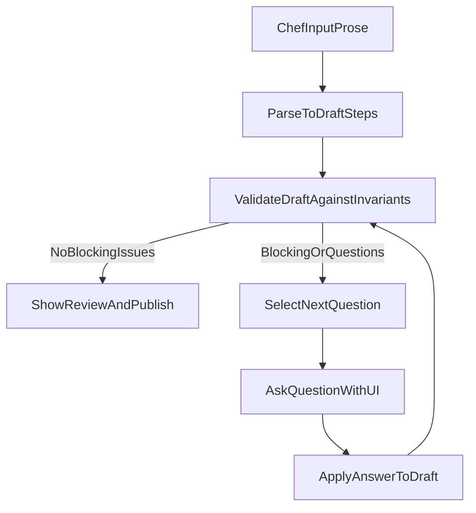

# Agent‑Mediated Line Build Authoring (Prototype Spec)

**Goal:** Enable a non-technical chef to author and maintain line builds by writing naturally (text/voice) while an AI agent **interviews** them to capture/confirm structured fields. The chef experiences a conversation + lightweight UI prompts, not a rigid form.

**Core design principle:** **Validation through conversation**. The schema is an internal contract and the agent’s checklist, not the user interface.

This spec is written so another coding agent can implement a prototype end-to-end.

---

## Table of contents

- [1. What we’re building (experience-first)](#1-what-were-building-experience-first)
- [2. System boundaries](#2-system-boundaries)
- [3. Data model (schema)](#3-data-model-schema)
  - [3.1 TypeScript interfaces](#31-typescript-interfaces)
  - [3.2 JSON Schema](#32-json-schema)
  - [3.3 Back-compat notes (benchtop MVP)](#33-back-compat-notes-benchtop-mvp)
- [4. Controlled vocabularies](#4-controlled-vocabularies)
- [5. Rules: invariants → interview questions](#5-rules-invariants--interview-questions)
- [6. Interview engine requirements](#6-interview-engine-requirements)
  - [6.1 Flow overview](#61-flow-overview)
  - [6.2 Question selection and resolution order](#62-question-selection-and-resolution-order)
  - [6.3 Question specs (by field)](#63-question-specs-by-field)
  - [6.4 Provenance & confidence](#64-provenance--confidence)
- [7. UX requirements (chef-facing)](#7-ux-requirements-chef-facing)
- [8. Example interactions (worked)](#8-example-interactions-worked)
- [9. Telemetry & quality metrics](#9-telemetry--quality-metrics)
- [10. Open questions / knobs](#10-open-questions--knobs)

---

## 1. What we’re building (experience-first)

### Primary experience

1. **Chef writes steps as they normally would** (paste from notes, type, or dictate).
2. The system immediately shows a **draft interpretation** (a step list) and starts an **agent interview**.
3. The agent asks **targeted clarifying questions**, one at a time, using:
   - quick buttons (single-select / multi-select)
   - short numeric inputs (time/quantity)
   - pickers (BOM component, equipment)
   - “confirm/override” confirmations
4. The chef can always:
   - accept a suggestion
   - override it (“No, it’s actually …”)
   - skip (“Not sure”) when allowed
5. The system produces a structured line build that can be:
   - **saved as draft** even if incomplete
   - **published** once hard invariants are satisfied (and optionally strong invariants depending on enforcement level)

### Maintenance experience (day 2)

- Chef can ask: “**Switch all salsa steps to spoodle 2oz**”
- Agent translates intent into an explicit filter → preview → apply flow (same safety model as `apps/benchtop-mvp` Changes page).
- Chef never builds queries; they confirm previews.

---

## 2. System boundaries

### In scope for prototype

- Single-user authoring session.
- “Paste prose → interview → structured build” for **one menu item**.
- Minimal “bulk edit intent → preview → apply” (can be limited to tool/station/action-family changes).
- Validation rules implemented as a deterministic layer that produces agent questions.

### Out of scope for prototype

- Production persistence, collaboration, permissions.
- Full KDS integration / display generation parity.
- Perfect controlled vocab completeness (prototype can use partial lists + “Add new…”).

---

## 3. Data model (schema)

This schema intentionally aligns with existing repository patterns:
- Benchtop MVP types: `apps/benchtop-mvp/src/lib/model/types.ts`
- Extension points: `schema/EXTENSION-POINTS.md`
- Invariants: `schema/INVARIANTS.md`

### 3.1 TypeScript interfaces

Use these as the canonical prototype contract. (If the implementer prefers Zod, mirror these 1:1.)

```typescript
// -----------------------------
// Identity
// -----------------------------
export type BuildId = string;
export type StepId = string;
export type MenuItemId = string;     // 80*
export type BomComponentId = string; // 40*
export type BomUsageId = string;     // 40*/41* usage abstraction (optional in v1)

// -----------------------------
// Root object
// -----------------------------
export interface LineBuildV1 {
  id: BuildId;
  menuItemId: MenuItemId;
  version: number;
  status: 'draft' | 'published';

  // Optional lanes / grouping (not required for prototype)
  tracks?: TrackDefinition[];
  operations?: Operation[];

  steps: StepV1[];

  createdAt: string; // ISO
  updatedAt: string; // ISO
}

export interface Operation {
  id: string;
  name: string;
  type: 'cook' | 'assemble' | 'prep';
}

export interface TrackDefinition {
  id: string;          // "hot", "cold", "expo" (examples)
  name: string;        // display label
  defaultStationId?: string;
}

// -----------------------------
// Step
// -----------------------------
export type StepKind = 'component' | 'meta' | 'bundle' | 'action' | 'quality_check';

export interface StepV1 {
  id: StepId;

  // Deterministic ordering for now (DAG is future).
  orderIndex: number;
  trackId?: string;
  operationId?: string;

  kind: StepKind;

  // Required semantic spine
  action: StepAction;

  // Target is strongly recommended for component steps
  target?: StepTarget;

  // Execution details (inheritable defaults)
  stationId?: string;
  toolId?: string;

  equipment?: StepEquipment;
  time?: StepTime;

  cookingPhase?: CookingPhase;
  container?: StepContainer;

  // Explicit negation
  exclude?: boolean;

  // Escape hatch (always allowed)
  notes?: string;

  // Variant logic (bounded predicates)
  conditions?: StepCondition[];
  overlays?: StepOverlay[];

  // Future
  dependsOn?: StepId[];

  // Quality
  provenance?: StepProvenance;
}

// -----------------------------
// Action
// -----------------------------
export enum ActionFamily {
  PREP = 'PREP',
  HEAT = 'HEAT',
  TRANSFER = 'TRANSFER',
  COMBINE = 'COMBINE',
  ASSEMBLE = 'ASSEMBLE',
  PORTION = 'PORTION',
  CHECK = 'CHECK',
  VEND = 'VEND',
  OTHER = 'OTHER'
}

export interface StepAction {
  family: ActionFamily;
  detailId?: string;              // free-form in v1
  displayTextOverride?: string;   // for legacy display fixes only
}

// -----------------------------
// Target
// -----------------------------
export type TargetType = 'bom_usage' | 'bom_component' | 'packaging' | 'free_text' | 'unknown';

export interface StepTarget {
  type: TargetType;

  // Structured references (optional in v1)
  bomUsageId?: BomUsageId;
  bomComponentId?: BomComponentId;

  // Fallback human-readable name
  name?: string;
}

// -----------------------------
// Equipment / time / phase / container
// -----------------------------
export interface StepEquipment {
  applianceId: string; // e.g. "turbo", "fryer", "waterbath"
  presetId?: string;
}

export interface StepTime {
  durationSeconds: number;
  isActive: boolean; // true = chef busy, false = waiting
}

export enum CookingPhase {
  PRE_COOK = 'PRE_COOK',
  COOK = 'COOK',
  POST_COOK = 'POST_COOK',
  PASS = 'PASS',
}

export type ContainerType =
  | 'bag'
  | 'bowl'
  | 'pan'
  | 'tray'
  | 'clamshell'
  | 'ramekin'
  | 'cup'
  | 'foil'
  | 'lid'
  | 'other';

export interface StepContainer {
  type?: ContainerType;
  name?: string; // "AMBER Pan", "32oz Pulp Bowl"
  size?: string; // "32oz" (string to avoid unit system complexity)
}

// -----------------------------
// Variants (anti-cloning)
// -----------------------------
export interface StepCondition {
  requiresEquipmentProfileId?: string[]; // OR list (any match)
  requiresCapability?: string[];         // OR list (any match)
  requiresCustomizationValueId?: string[]; // AND list (all must be present)
  minCustomizationCount?: number;
  requiresRestaurantId?: string[];       // avoid in prototype unless needed
}

export interface StepOverlay {
  id: string;
  predicate: {
    equipmentProfileId?: string;
    customizationValueIds?: string[];
    minCustomizationCount?: number;
  };
  overrides: Partial<Pick<StepV1, 'stationId' | 'toolId' | 'time' | 'notes' | 'equipment' | 'cookingPhase' | 'container'>>;
  priority: number; // higher wins
}

// -----------------------------
// Provenance
// -----------------------------
export type ProvenanceType = 'manual' | 'inherited' | 'overlay' | 'inferred' | 'legacy_import';
export type Confidence = 'high' | 'medium' | 'low';

export interface FieldProvenance {
  type: ProvenanceType;
  sourceId?: string; // model run id, bomId, overlayId, etc.
  confidence?: Confidence;
}

export interface StepProvenance {
  action?: FieldProvenance;
  target?: FieldProvenance;
  stationId?: FieldProvenance;
  toolId?: FieldProvenance;
  equipment?: FieldProvenance;
  time?: FieldProvenance;
  cookingPhase?: FieldProvenance;
  container?: FieldProvenance;
  exclude?: FieldProvenance;
  notes?: FieldProvenance;
}

// -----------------------------
// Supporting reference data
// -----------------------------
export interface BomComponent {
  id: BomComponentId;
  name: string;
  canonicalQty?: number;
  canonicalUom?: string;
}

export interface MenuItemBomDefaults {
  menuItemId: MenuItemId;
  bomId: BomComponentId;
  defaultStationId?: string;
  defaultToolId?: string;
  defaultPortionDisplay?: string;
}

export interface EquipmentProfile {
  id: string;
  label: string;
  capabilities: string[];
}

export interface CustomizationValue {
  optionId: string;
  valueId: string;
  label: string;
}
```

### 3.2 JSON Schema

This JSON Schema is sufficient for validating the prototype payloads (draft 2020-12 style, but implementer can treat it as generic JSON Schema).

```json
{
  "$id": "LineBuildV1.schema.json",
  "type": "object",
  "required": ["id", "menuItemId", "version", "status", "steps", "createdAt", "updatedAt"],
  "properties": {
    "id": { "type": "string" },
    "menuItemId": { "type": "string" },
    "version": { "type": "number" },
    "status": { "type": "string", "enum": ["draft", "published"] },
    "tracks": {
      "type": "array",
      "items": {
        "type": "object",
        "required": ["id", "name"],
        "properties": {
          "id": { "type": "string" },
          "name": { "type": "string" },
          "defaultStationId": { "type": "string" }
        },
        "additionalProperties": false
      }
    },
    "operations": {
      "type": "array",
      "items": {
        "type": "object",
        "required": ["id", "name", "type"],
        "properties": {
          "id": { "type": "string" },
          "name": { "type": "string" },
          "type": { "type": "string", "enum": ["cook", "assemble", "prep"] }
        },
        "additionalProperties": false
      }
    },
    "steps": {
      "type": "array",
      "items": { "$ref": "#/$defs/StepV1" }
    },
    "createdAt": { "type": "string" },
    "updatedAt": { "type": "string" }
  },
  "additionalProperties": false,
  "$defs": {
    "StepV1": {
      "type": "object",
      "required": ["id", "orderIndex", "kind", "action"],
      "properties": {
        "id": { "type": "string" },
        "orderIndex": { "type": "number" },
        "trackId": { "type": "string" },
        "operationId": { "type": "string" },
        "kind": { "type": "string", "enum": ["component", "meta", "bundle", "action", "quality_check"] },
        "action": {
          "type": "object",
          "required": ["family"],
          "properties": {
            "family": { "type": "string", "enum": ["PREP", "HEAT", "TRANSFER", "COMBINE", "ASSEMBLE", "PORTION", "CHECK", "VEND", "OTHER"] },
            "detailId": { "type": "string" },
            "displayTextOverride": { "type": "string" }
          },
          "additionalProperties": false
        },
        "target": {
          "type": "object",
          "required": ["type"],
          "properties": {
            "type": { "type": "string", "enum": ["bom_usage", "bom_component", "packaging", "free_text", "unknown"] },
            "bomUsageId": { "type": "string" },
            "bomComponentId": { "type": "string" },
            "name": { "type": "string" }
          },
          "additionalProperties": false
        },
        "stationId": { "type": "string" },
        "toolId": { "type": "string" },
        "equipment": {
          "type": "object",
          "required": ["applianceId"],
          "properties": {
            "applianceId": { "type": "string" },
            "presetId": { "type": "string" }
          },
          "additionalProperties": false
        },
        "time": {
          "type": "object",
          "required": ["durationSeconds", "isActive"],
          "properties": {
            "durationSeconds": { "type": "number", "exclusiveMinimum": 0 },
            "isActive": { "type": "boolean" }
          },
          "additionalProperties": false
        },
        "cookingPhase": { "type": "string", "enum": ["PRE_COOK", "COOK", "POST_COOK", "PASS"] },
        "container": {
          "type": "object",
          "properties": {
            "type": { "type": "string", "enum": ["bag", "bowl", "pan", "tray", "clamshell", "ramekin", "cup", "foil", "lid", "other"] },
            "name": { "type": "string" },
            "size": { "type": "string" }
          },
          "additionalProperties": false
        },
        "exclude": { "type": "boolean" },
        "notes": { "type": "string" },
        "conditions": { "type": "array", "items": { "type": "object" } },
        "overlays": { "type": "array", "items": { "type": "object" } },
        "dependsOn": { "type": "array", "items": { "type": "string" } },
        "provenance": { "type": "object" }
      },
      "additionalProperties": false
    }
  }
}
```

### 3.3 Back-compat notes (benchtop MVP)

The benchtop MVP’s `Step` currently uses:
- `targetBomId?: BomId` instead of `target?: StepTarget`
- `methodId?: string` for capability filtering
- `overlays?: StepOverlay[]` as implemented in `apps/benchtop-mvp/src/lib/model/resolver/index.ts`

Prototype implementer options:

- **Option A (fastest):** Keep MVP `Step` fields and add the new fields (`cookingPhase`, `container`, `exclude`, `targetName`) without breaking the UI.
- **Option B (cleaner):** Introduce `StepTarget` and gradually migrate UI logic from `targetBomId` → `target`.

This spec assumes **Option B** as the contract, but Option A is acceptable for a prototype if the agent can still produce structured output.

---

## 4. Controlled vocabularies

Controlled vocab is split into:
- **Authoring vocab** (what chef picks during interview)
- **Scoring vocab** (extra dimensions like location/technique weights; can be partial in prototype)

### 4.1 Action families (authoring)

Fixed enum: `ActionFamily` (see schema).

### 4.2 Equipment profiles and capabilities (authoring + variants)

From fixtures:
- `apps/benchtop-mvp/src/lib/model/data/fixtures/equipment-profiles.json`

Example:
- `profile_standard` → `["turbo","garnish"]`
- `profile_high_volume` → `["turbo","fryer","garnish"]`
- `profile_waterbath` → `["waterbath","garnish"]`

**Prototype requirement:** capabilities are strings; the agent can map free-text (“turbo oven”) → capability `"turbo"` with confidence.

### 4.3 Stations and tools (authoring)

In the MVP these are plain strings in BOM defaults:
- `apps/benchtop-mvp/src/lib/model/data/fixtures/bom-defaults.json` (e.g. `cold_storage`, `dry_storage`, `tongs`, `hand`)
- `apps/benchtop-mvp/src/lib/model/data/synthetic/bom-defaults.json` (e.g. `st_grill`, `st_fry`, `t_tongs`, `t_scoop_4oz`, `t_spatula`)

**Prototype requirement:**
- Treat `stationId` / `toolId` as **controlled but extensible**.
- Present existing values as pick-list, with “Add new…” and “Not sure” options.
- When user enters a new station/tool, the agent must ask: “Is this a new standard term?” and store it as pending vocabulary if approved.

### 4.4 Cooking phase (authoring)

Enum: `PRE_COOK`, `COOK`, `POST_COOK`, `PASS`.

### 4.5 Containers (authoring)

`container.type` is controlled, `container.name/size` are free text.

### 4.6 Scoring vocab (optional for prototype)

From the Shin requirements-capture prompt (incomplete; used as seed vocab):
- Locations (with weights): Cold Storage, Hot Hold, Fryer, Waterbath, Turbo, In Kit, Grab, None
- Techniques (with weights): Open Pouch, Clamshell, Tongs, Stir, Hand, Squeeze, Fry, Place, Pass, None

**Prototype requirement:** even if scoring isn’t implemented, the authoring experience should capture enough structure (action, equipment, time, station/tool, container, phase) to enable scoring later.

---

## 5. Rules: invariants → interview questions

Source of truth: `schema/INVARIANTS.md` plus MVP validation (`apps/benchtop-mvp/src/lib/model/validation/index.ts`).

### 5.1 Invariant tiers and agent behavior

- **Hard invariant:** agent must block “Publish” until resolved. Agent must ask (or infer with explicit confirmation).
- **Strong invariant:** agent must ask once, but chef may “Skip for now” (draft allowed).
- **Soft invariant:** agent may suggest, but should not nag.
- **Deferred:** no enforcement in prototype.

### 5.2 Canonical invariants (prototype)

| ID | Tier | Rule | Agent behavior |
|---|---|---|---|
| H1 | Hard | Every step has `action.family` | If missing/low-confidence, ask “What kind of step is this?” (buttons) |
| H2 | Hard | `orderIndex` present + unique | Auto-assign. If parallel implied, ask for ordering or track split |
| H3 | Hard | If `time` exists: `durationSeconds > 0` and `isActive` boolean | Validate input; re-ask if invalid |
| H4 | Hard | Containers are not targets | If container-like token detected in target/name, ask to classify |
| H5 | Hard | `notes` always allowed | Never block on missing structure if notes exist (draft save always allowed) |
| S1 | Strong | Component steps should have target | Ask target picker (BOM list), allow “unknown” |
| S2 | Strong | HEAT steps should have equipment | Ask equipment picker, allow “unknown” but warn |
| S3 | Strong | VEND steps should include container/packaging | Ask packaging/container question |
| S4 | Strong | Phase markers in text should match `cookingPhase` | If text contains “post cook”, suggest phase and ask to confirm |
| S5 | Strong | Negation patterns should set `exclude=true` | If “no/omit/without/hold” appears, ask “Is this an exclusion?” |
| V1 | Warning | `action.family === OTHER` should be minimized | Agent suggests best family and asks to confirm |
| V2 | Error (optional) | Method/coverage gaps for equipment profiles (MVP-style) | If variants mention equipment, ensure at least one path per selected profile/capability (prototype can warn only) |

---

## 6. Interview engine requirements

### 6.1 Flow overview

At a high level:



**Key rule:** the agent never invents critical facts silently. If it infers, it must either:
- mark provenance as `inferred` with confidence, and
- present a confirm step (explicitly or via UI default selection that user can change).

### 6.1.1 Deterministic parsing requirements (before LLM)

The prototype should do lightweight deterministic work before calling the LLM:

- **Step splitting**:
  - split by newline first
  - if no newlines, split on sentence boundaries (`.` `;`) while preserving abbreviations
  - trim empty lines
- **Canonicalize common time strings**:
  - `(\d+)\s*(sec|secs|second|seconds)` → seconds
  - `(\d+)\s*(min|mins|minute|minutes)` → seconds
- **Detect obvious negation lines**:
  - if line starts with “no ” / “without ” / “omit ” → candidate `exclude=true`
- **Detect obvious container tokens** using the seed regex in Q6.

Rationale: reduces hallucination risk and stabilizes the interview (the LLM refines a deterministic draft instead of inventing structure from scratch).

### 6.2 Question selection and resolution order

The agent maintains a queue of “issues” produced by the validator:

```typescript
type Severity = 'block' | 'warn' | 'info';

interface ValidationIssue {
  id: string;                 // "H1", "S2", etc.
  severity: Severity;
  stepId?: string;            // if step-scoped
  message: string;            // chef-facing
  evidence?: string;          // snippet from notes/input
  suggestedFix?: any;         // structured suggestion (optional)
  question?: AgentQuestion;   // if interactive clarification is needed
}
```

**Selection algorithm (deterministic):**
1. All `block` issues, ascending by:
   - build-scoped before step-scoped
   - then step orderIndex
   - then invariant priority: H1 → H4 → H3 → H2 (ordering last unless ambiguous)
2. Then `warn` issues similarly.
3. `info` only if user asks “Improve quality” or clicks “Continue cleanup”.

### 6.3 Question specs (by field)

Each question must define:
- trigger condition
- UI control type
- allowed answers
- how answer mutates the draft
- provenance updates

#### Q1 — Action family classification

- **Trigger:** step missing `action.family` OR `action.family` inferred with confidence < threshold (default 0.80).
- **UI:** single-select buttons for `ActionFamily`, plus “Not sure”.
- **Answer effects:**
  - set `step.action.family`
  - set `step.provenance.action = { type: 'manual' | 'inferred', confidence }`
  - if user selects HEAT, enqueue equipment/time/phase questions as needed

#### Q2 — Target selection (component steps)

- **Trigger:** `step.kind === 'component'` and missing/unknown target.
- **UI:** searchable picker:
  - “Pick from BOM” (list of `BomComponent`)
  - “Type a name” (free text)
  - “Unknown / implied” (allowed in draft)
- **Answer effects:**
  - if BOM selected: set `target.type='bom_component'`, `target.bomComponentId`, `target.name`
  - if free text: `target.type='free_text'`, `target.name`
  - provenance: `manual` if user chose; `inferred` if agent suggested and user confirmed

#### Q3 — Equipment selection (HEAT)

- **Trigger:** `action.family === HEAT` and missing equipment.
- **UI:** searchable list:
  - common appliances (turbo, fryer, waterbath…)
  - “Other…” free text
  - “Unknown”
- **Answer effects:** set `step.equipment.applianceId`, provenance.

#### Q4 — Time capture

- **Trigger (strong):** HEAT step missing `time`, or any step includes timing phrases (“5 min”) but structured time missing.
- **UI:** numeric duration + unit (sec/min), plus “active vs waiting” toggle.
- **Answer effects:** set `step.time`, validate H3.

#### Q5 — Cooking phase

- **Trigger:** notes contain phase marker OR step is HEAT and phase missing (optional enforcement).
- **UI:** PRE_COOK / COOK / POST_COOK / PASS.
- **Answer effects:** set `step.cookingPhase`, provenance.

#### Q6 — Container vs target disambiguation (H4)

- **Trigger:** evidence suggests container (regex seed: bag/bowl/pan/tray/clamshell/ramekin/cup/foil/lid/pulp).
- **UI:** “This looks like a container. What is it?”
  - Container
  - Ingredient/component
  - Both (split into two steps)
- **Answer effects:**
  - if container: move token into `step.container.name/type`, clear target if it was container-only
  - if split: create new step with TRANSFER or VEND as appropriate, adjust ordering

#### Q7 — Negation (“No X”) (S5)

- **Trigger:** notes match `\b(no|hold|without|skip|omit)\b`.
- **UI:** “Is this an exclusion?”
  - Yes (exclude = true)
  - No (it’s just phrasing)
- **Answer effects:** set `exclude`, provenance.

#### Q8 — Station/tool confirmation (vocab enforcement)

- **Trigger:** station/tool inferred but not in known list OR conflicts with defaults.
- **UI:** select from list + “Add new…”.
- **Answer effects:** set station/tool; if “Add new” chosen, create vocabulary candidate entry.

#### Q9 — Variant / overlay identification (optional in prototype)

- **Trigger:** text contains explicit conditional language (“if waterbath… otherwise turbo…”, “for high volume kitchens…”).
- **UI:** “Does this step change based on equipment/customization?”
  - Yes → guided creation of overlay predicate
  - No
- **Answer effects:** add `overlays[]` or `conditions[]`.

### 6.4 Provenance & confidence

All agent-filled fields must include provenance:
- `inferred` with confidence when derived from text
- upgraded to `manual` when user confirms/edits

**Prototype minimum:** store provenance at least for `action`, `target`, `equipment`, `time`, `cookingPhase`, `container`.

### 6.5 Agent contract (LLM I/O)

The implementer should use **structured outputs** (function calling or JSON schema-validated output) so the UI can render questions as components.

#### 6.5.1 Core request context

```typescript
export interface AgentContext {
  menuItem: { id: string; name: string };
  bomComponents: Array<{ id: string; name: string }>;
  bomDefaults: Array<{ menuItemId: string; bomId: string; defaultStationId?: string; defaultToolId?: string }>;
  equipmentProfiles: Array<{ id: string; label: string; capabilities: string[] }>;
  customizations: Array<{ optionId: string; valueId: string; label: string }>;
  knownStations: string[]; // derived from bomDefaults + prior vocabulary
  knownTools: string[];    // derived from bomDefaults + prior vocabulary
}
```

#### 6.5.2 Parse request/response

```typescript
export interface ParseProseRequest {
  rawText: string; // chef prose
  priorDraft?: LineBuildV1; // if editing existing
  context: AgentContext;
}

export interface ParseProseResponse {
  draft: LineBuildV1;
  issues: ValidationIssue[]; // initial issues found (agent-friendly)
  nextQuestion?: AgentQuestion; // optional immediate first question
}
```

#### 6.5.3 Question schema (UI-generatable)

```typescript
export type UIControl =
  | { type: 'single_select'; options: Array<{ id: string; label: string }>; allowCustom?: boolean }
  | { type: 'multi_select'; options: Array<{ id: string; label: string }>; min?: number; max?: number }
  | { type: 'text'; placeholder?: string; maxLength?: number }
  | { type: 'number'; unitOptions?: string[]; min?: number; max?: number }
  | { type: 'confirm'; confirmLabel?: string; denyLabel?: string };

export interface AgentQuestion {
  id: string;         // stable id for this question instance (e.g. "q_step_2_equipment")
  issueId: string;    // ties back to invariant like "S2"
  stepId?: string;
  prompt: string;     // chef-facing
  helpText?: string;  // short rationale (“Needed for scoring / consistency”)
  control: UIControl;
  defaultAnswerId?: string; // if single-select, preselect this
}

export interface AgentAnswer {
  questionId: string;
  value:
    | { type: 'id'; id: string }
    | { type: 'ids'; ids: string[] }
    | { type: 'text'; text: string }
    | { type: 'number'; value: number; unit?: string }
    | { type: 'boolean'; value: boolean };
}
```

#### 6.5.4 Apply-answer contract

```typescript
export interface ApplyAnswerRequest {
  draft: LineBuildV1;
  answer: AgentAnswer;
  context: AgentContext;
}

export interface ApplyAnswerResponse {
  draft: LineBuildV1;        // updated
  issues: ValidationIssue[]; // revalidated
  nextQuestion?: AgentQuestion;
}
```

**Important:** `ApplyAnswer` should be deterministic and replayable. The LLM can propose edits, but a deterministic reducer must apply them (or validate the patch shape) so the system can guarantee invariants like `orderIndex` uniqueness.

### 6.6 Maintenance: bulk edit intent → preview → apply (prototype)

If implementing maintenance, reuse the proven safety model in `apps/benchtop-mvp`:
- filter → preview impact → apply → audit record (+undo)

Recommended minimal contract:

```typescript
export type BulkEditStrategy = 'step' | 'defaults';

export interface BulkEditProposal {
  summary: string;
  confidence: number; // 0..1
  strategy: BulkEditStrategy;
  filter: {
    targetBomId?: string;
    actionFamily?: ActionFamily;
    stationId?: string;
    toolId?: string;
    searchTerm?: string;
  };
  patch: {
    actionFamily?: ActionFamily;
    stationId?: string;
    toolId?: string;
  };
  questions?: AgentQuestion[]; // if ambiguous (“which salsa?”)
}
```

**UI requirement:** Always show:
- affected menu items count
- affected steps count
- before/after diff examples
- validation warnings delta (before vs after)
- explicit “Apply” confirmation

---

## 7. UX requirements (chef-facing)

### Layout (recommended)

- Left: “Chef input” editor (multi-line prose, voice-to-text optional)
- Middle: conversation thread (agent questions + quick UI)
- Right: live “Build preview” (structured step table + generated cook-facing text)

### UX rules

- Always show “what the system thinks” before asking follow-ups.
- One question at a time (avoid overwhelming).
- Every question must have:
  - a suggested default (if confidence is high)
  - a “Not sure / skip” path when not hard-blocking
- Publishing must be explicit:
  - “Draft save” always available
  - “Publish” gated by hard invariants (and optionally strong invariants if enforcement mode enabled)

### 7.1 Chef control & transparency requirements

- **Undo within session:** user can undo last answer (at least 1 step).
- **“Show me what you understood”:** user can toggle viewing structured fields per step.
- **Explain why you’re asking:** every question includes 1-line “why” (ties to invariant/scoring).
- **Never trap the user:** if a question blocks publish, allow saving draft without answering.

### 7.2 Generated UI patterns (agent → UI)

The system should support the following UI components, generated from `AgentQuestion.control`:
- single-select pill buttons (ActionFamily, CookingPhase)
- searchable dropdown (BOM component, equipment, station/tool)
- numeric input with unit toggle (time)
- confirm dialog (container-vs-target split, repeated target)

### 7.3 Draft preview rendering rules

The preview should render each step with:
- `orderIndex`
- `action.family` (and `detailId` if present)
- `target.name` (or “(no target)”)
- `equipment.applianceId` + time (if HEAT)
- station/tool (effective value = step override OR inherited default)
- provenance badge (manual/inferred/inherited/overlay) for key fields

This mirrors the benchtop MVP’s “provenance badges” pattern described in `apps/benchtop-mvp/CURRENT_STATE_AND_WORKFLOWS.md`.

---

## 8. Example interactions (worked)

### Example A — Simple salad (minimal interview)

**Chef input**
> “Put greens in bowl. Add vinaigrette. Toss. Lid and bag.”

**Agent draft (auto)**
1. ASSEMBLE (greens) — notes: “Put greens in bowl”
2. COMBINE (vinaigrette) — notes: “Add vinaigrette”
3. COMBINE (salad) — notes: “Toss”
4. VEND — notes: “Lid and bag”

**Agent questions**
- Q2 target for step 1: “Which greens?” → pick `Mixed Greens (4000003)` (manual)
- Q6 container disambiguation for step 1 (“bowl”): “Is bowl a container?” → Container → set `container.name="Bowl"` on step 1 (or create TRANSFER step)
- Q3 equipment: none (no HEAT)
- Q6 packaging for step 4 (“bag”): set `container.type='bag'`, `container.name='Delivery Bag'`

**Result:** publishable (hard invariants satisfied; strong invariants mostly satisfied).

### Example B — Chicken sandwich (HEAT + phase + equipment)

**Chef input**
> “Open chicken pouch. Waterbath 5 min. Transfer to amber pan (post cook). Toast bun in turbo 30 sec. Build sandwich. Wrap and bag.”

**Agent draft (auto)**
1. PREP — target: Chicken Breast — detail: open_pouch
2. HEAT — target: Chicken Breast — equipment: waterbath — time: 5 min (waiting)
3. TRANSFER — container: AMBER Pan — notes: “post cook”
4. HEAT — target: Brioche Bun — equipment: turbo — time: 30 sec (waiting)
5. ASSEMBLE — notes: “Build sandwich”
6. VEND — container: wrapper + bag

**Agent questions (examples)**
- Confirm step 2 `isActive=false`? (waiting) → Yes
- Step 3 cookingPhase inferred from “post cook” → confirm POST_COOK
- Step 4: “Does turbo step require a tool?” (if rule exists) → select “paddle”

### Example D — Full before/after payload (one answered question)

**Question (S2: HEAT needs equipment)**

```json
{
  "id": "q_step_2_equipment",
  "issueId": "S2",
  "stepId": "step_2",
  "prompt": "You wrote a heating step. What equipment is used here?",
  "helpText": "Needed to ensure the step resolves correctly for different kitchens and supports complexity scoring.",
  "control": {
    "type": "single_select",
    "options": [
      { "id": "turbo", "label": "Turbo" },
      { "id": "fryer", "label": "Fryer" },
      { "id": "waterbath", "label": "Waterbath" },
      { "id": "unknown", "label": "Not sure" }
    ]
  },
  "defaultAnswerId": "waterbath"
}
```

**Answer**

```json
{ "questionId": "q_step_2_equipment", "value": { "type": "id", "id": "waterbath" } }
```

**Draft mutation (step excerpt)**

```json
{
  "id": "step_2",
  "action": { "family": "HEAT" },
  "equipment": { "applianceId": "waterbath" },
  "provenance": {
    "equipment": { "type": "manual", "confidence": "high" }
  }
}
```

### Example C — Ambiguity + repeated target + negation

**Chef input**
> “No pickles. Add sauce. Put chicken on bun. Put bun in bag.”

**Agent behavior**
- Detect negation: ask “Is ‘No pickles’ an exclusion?” → sets `exclude=true`
- “Add sauce” ambiguous target: ask “Which sauce?” (BOM picker)
- “Put bun in bag” splits: TRANSFER bun → container bag OR VEND packaging step

---

## 9. Telemetry & quality metrics

Minimum metrics:
- time-to-first-draft (parse latency)
- number of questions asked per build
- % questions answered vs skipped
- hard invariant pass rate at publish
- `OTHER` usage rate
- inferred→manual confirmation rate by field

---

## 10. Open questions / knobs

- **Enforcement mode:** publish gates on Hard only vs Hard+Strong.
- **Confidence thresholds:** when to auto-fill vs ask.
- **Variant scope:** do we support equipment/customization predicates in prototype or defer?
- **Two-location problem:** represent as TRANSFER step vs from/to fields.
- **Controlled vocab governance:** who approves new stations/tools/equipment terms?


